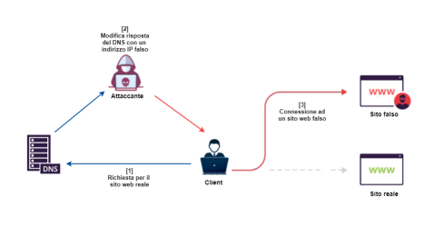

<h1 align="center" id="title">DNS Spoofer</h1>

<p align="center">
  
  
  
</p>


<p align="center">
    
</p>

<p id="description"> dns-spoofer is a Python program designed to perform DNS spoofing by modifying DNS reply packets using the NetfilterQueue module in Python. It intercepts outgoing DNS packets, modifies them to redirect the requested domain to a user-specified IP address, and then forwards them to the intended recipient.

  It is important to note that DNS spoofing is a potentially illegal and unethical activity if used without proper authorization. This tool should only be used for educational purposes or on authorized networks with the explicit permission of the network owner.

  Ensure that you have the necessary permissions to run the program and perform DNS spoofing on your network. </p>


<h2>🛠️ Installation Steps:</h2>

<p>Install the requirements:</p>

```
pip -r requirements.txt
```

<h2>🖥️ Usage: </h2>

You **MUST** be already a Man-in-the-Middle, otherwise it won't work. See my <a href="https://github.com/mirawara/arp-spoofer">arp-spoofer</a> for example.

<p>Manual:</p>


```
dns-spoofer.py [-h] -dh HOSTS

options:
  -h, --help            show this help message and exit
  -dh DNS HOSTS, --dns-hosts DNS HOSTS
                        name of the json file containing the hosts
```

 
 <p>Example: </p>

```
python dns-spoofer.py -dh hosts.json
```

<h2>😉 Tip: </h2>

Use dns-spoofer together with my <a href="https://github.com/mirawara/arp-spoofer">arp-spoofer</a>.

<h2>💖Like my work?</h2>

Contact me if you have any corrections or additional features to offer.
